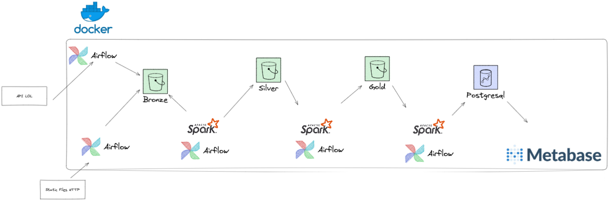

# League of data ingestion

Projeto para a pratica de criação de data pipelines. Buscando os dados dos desafiantes do Brasil, e suas ultimas partidas, armazenando em um data lake local.

## Arquitetura

